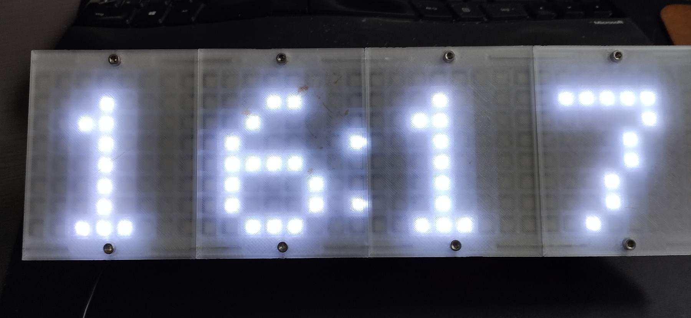
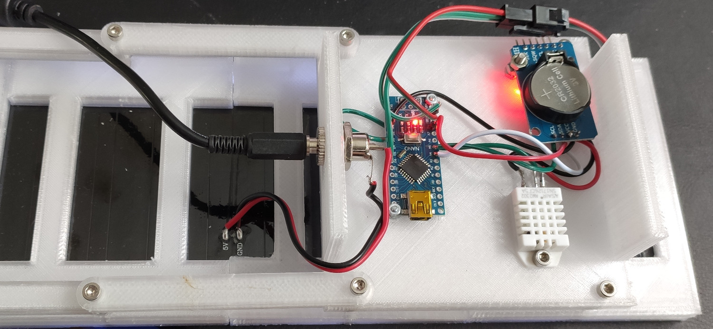

# About
With some stuff lying around I've build a simple matrix clock, showing time, date, temperature and humidity.
Parts:
* Arduino Nano
* DS3231 Realtime-Clock
* AM2302 / DHT22 Temperature/Humidity Sensor
* Neopixel 32x8 RGB-LED Matrix
* A few 3D printed parts

# Wiring
The 5V Power Supply is connected to the Power-In of the LED Matrix. The Arduino and Sensors are powered over the 3-wire connector of the LED-Matrix.
DIN of the LED-Matrix is wired to D6
The DHT/AM2302 is wired to D3

# Images

